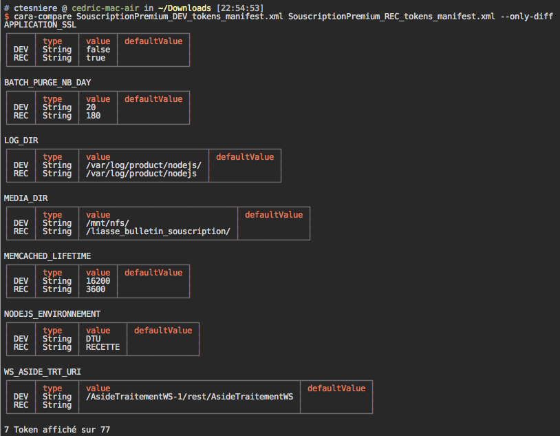

# cara-compare

[](http://badge.fury.io/js/cara-compare-cli)
[](https://snyk.io/test/npm/cara-compare-cli)
[](https://david-dm.org/ctesniere/cara-compare-cli#info=devDependencies)
[](https://www.npmjs.com/package/cara-compare-cli)  
[](https://nodei.co/npm/cara-compare-cli/)

## Exemple

```sh
$ cara-compare token_DEV.xml ../token_PRO.xml
```

## Screenshot


